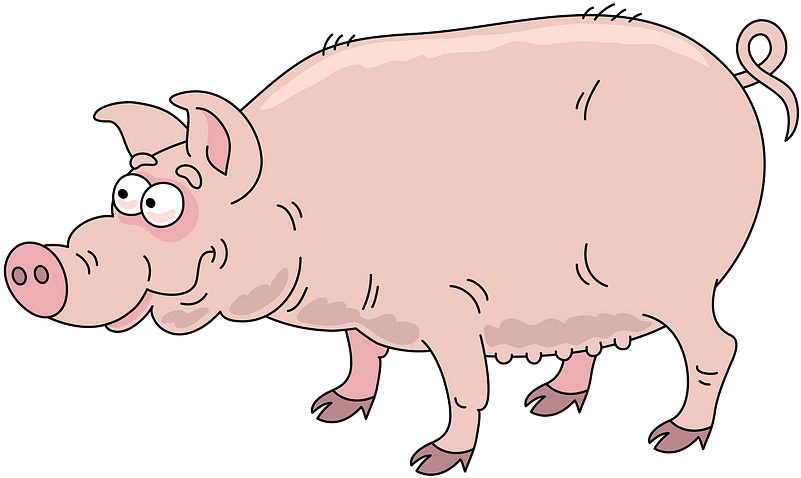

  
  <h3 align="center">piglatin</h3>
  
Pig Latin translator

---

`piglatin` is a fast pipeline [Pig Latin](https://en.wikipedia.org/wiki/Pig_Latin) translator written in Go. 

## Badges

## Description

### The algorithm of work
- Ensures proper capitalization
- Correct upper case and lower case formatting
- Correctly translates "qu" (e.g., ietquay instead of uietqay)
- Differentiates between "Y" as vowel and "Y" as consonant (e.g. yellow = ellowyay and style = ylestay)
- Correctly translates contractions
- Hyphenated words are treated as two words
- Words may consist of alphabetic characters only (A-Z and a-z)
- All punctuation, numerals, symbols and whitespace are not modified

### Supported languages
| Language | Key | Notes |
|---|---|---|
|English|`en`|is used implicitly by default|

## Usage
- Run `go run build` to build the project.
- Run `./piglatin`, enter the text that must be translated to the Pig Latin.
- Enter `:q` on a new line to exit.
- Run `./piglatin -h` see available options.

Or
- Run `./piglatin -source=input.txt -target=output.txt` to translate the text in the input file.

### Known issues
- In case of new parsers add, a priority or an explicit parser call should be implemented.
